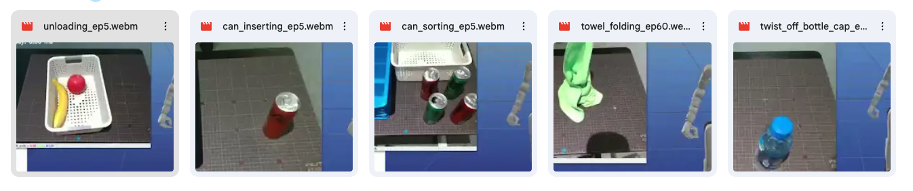

# 数据集说明

### [09/2025] 桌面5个任务，各收集了50 episode, 60fps

* **数据地址：** [Google Drive Link](https://drive.google.com/file/d/15PEmHs3PT6LVK9LfDirtgjoya5NoH_4O/view?usp=sharing)
* **数据可视化样例：** [Google Drive Link](https://drive.google.com/drive/folders/1AijEc_0u05rftFne_xciJ_3YHOXZ-q9P?usp=drive_link)

---

### 数据结构样例
```
├── can_inserting
│   ├── episode_0049
│   │   ├── audios
│   │   ├── colors
│   │   │   ├── 000382_color_0.jpg
│   │   │   ├── 000382_color_1.jpg
│   │   │   ├── 000382_color_2.jpg
│   │   │   ├── 000383_color_0.jpg
│   │   │   └── ...
│   │   ├── data.json
│   │   └── depths
│   └── ...
├── can_sorting
├── towel_folding
├── twist_off_bottle_cap
└── unloading
```
### 数据说明

+   每个episode的 `states/action` 数据在 `data.json` 中。
+   图像数据在 `colors` 文件夹下，包含头部D435、双手腕部D435的RGB图像（640x480）, 60FPS。
+   具体数据存储请查看: [`teleop_hand_and_arm.py` L699](https://github.com/hkustgz-hw/xr_teleoperate_hkustgz-hw/blob/main/teleop/teleop_hand_and_arm.py#L699)
+   可视化效果图：
    

---

## 采集注意事项

1.  **初始位置为：** 两臂垂直放于身体两侧，按住两手扳机，手部为close状态。
2.  **结束episode前** 要将手部状态恢复为初始位置。

---

## 任务自由度说明

* **单手操作任务 (共9自由度):** 手臂(7) + 手(1) + 腰(1)
    * *任务包括: [Can Inserting], [Can Sorting], [Unloading]*
* **双手操作任务 (共17自由度):** 手臂(14) + 手(2) + 腰(1)
    * *任务包括: [Towel Folding], [Twist off the bottle cap]*
* **双手整身控制任务 (共29自由度):** 手臂(14) + 手(2) + 腿(12) + 腰(1)
    * *任务包括: [Move box], [Open Cabinet] , [Move and Open Pot]*

---

## 任务详情

### [Can Inserting] 罐子放入方格

* **任务目标:** Pick the can into grid storage box.
* **任务描述:** Pick up the can from the table and place it into the grid storage box. The operation should be smooth and the can should not fall or tip over.
* **中文描述:** 把罐子放进方格储物盒里。
* **任务步骤:**
    1.  Search for the can.
    2.  Move to the can's location.
    3.  Pick up the can.
    4.  Move to the grid storage box.
    5.  Place the can into the box.

### [Can Sorting] 罐子分类

* **任务目标:** Pick the green can into grid storage box and pick others into basket.
* **任务描述:** Pick up the can from the table and place it into the grid storage box or the basket accordingly. The operation should be smooth and the can should not fall or tip over.
* **中文描述:** 把绿色罐子放方格箱，其他罐子瓶子放盒子。
* **任务步骤:**
    1.  Search for the can.
    2.  Move to the can's location.
    3.  Pick up the can.
    4.  If the can is green, move to the grid storage box. Otherwise, move to the basket.
    5.  Place the can into the box or basket.

### [Unloading] 取出货物(苹果香蕉)

* **任务目标:** Pick apple and banana from the basket and put them on the table.
* **任务描述:** Pick up the apple and banana from the basket and place it on table. The operation should be smooth and the items should not fall.
* **中文描述:** 从盒子取出苹果香蕉放到桌子上。
* **任务步骤:**
    1.  Search for the basket.
    2.  Move to the basket's location.
    3.  Pick up an apple or banana.
    4.  Move to the table.
    5.  Place the item on the table.
    6.  Repeat until the basket is empty of apples and bananas.

### [Towel Folding] 折叠毛巾【双手】

* **任务目标:** Fold towel twice.
* **任务描述:** Fold the towel twice.
* **中文描述:** 叠毛巾。双手拿起毛巾左上角和右上角，在空中拉直后平铺在桌子上。然后抓住一侧两角，对折一次。可根据需要调整毛巾方向，重复上述操作，共折叠两次。
* **任务步骤:**
    1.  Search for the towel’s top-left and top-right corners.
    2.  Grasp the top-left corner with the left hand and the top-right corner with the right hand.
    3.  Lift the towel in the air so it is straightened.
    4.  Lay the towel flat on the table.
    5.  Fold the towel once from front to back.
    6.  Turn the towel if needed.
    7.  Repeat the folding process.

### [Twist Off Bottle Cap] 拧开瓶盖【双手】

* **任务目标:** Twist off the bottle cap.
* **任务描述:** Twist off the bottle cap.
* **中文描述:** 左手拿起瓶子，右手拧开瓶盖，然后将瓶子和瓶盖都放在桌子上。
* **任务步骤:**
    1.  Search for the bottle.
    2.  Grasp the bottle with the left hand.
    3.  Twist off the bottle cap using the right hand.
    4.  Put the bottle and the cap on the table.

---

## 整身控制任务

### [Move Box] 搬箱子【整身】

* **任务目标:** Move the box from the ground to the table.
* **任务描述:** Move the box from the ground to the table.
* **中文描述:** 下蹲，双手拿起地上的箱子，然后站起来，走到旁边的桌子，最后把箱子放到桌子上。
* **任务步骤:**
    1.  Search for the box.
    2.  Lower the body and hold the box using both hands.
    3.  Stand up and turn to move to the table.
    4.  Put the box on the table.
